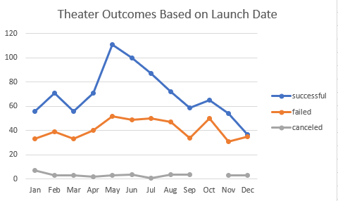
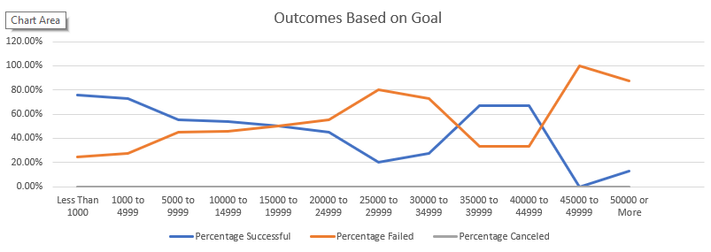

# Kickstarting with Excel

## Overview of Project
#### An analytical look at the data behind Kickstarter projects and their eventual outcomes.

### Purpose

#### The purpose of this analysis was to determine the optimal time period to start a successful Kickstarter campaign. In addition, there was an breakdown of how well Kickstarter campaigns performed at different funding ranges.    

### Analysis and Challenges

### Analysis of Outcomes Based on Launch Date

#### As seen in the above graph, the best months to launch a successful theater Kickstarter are May and June. There is a large spike in successful projects around these months with a success rate of around 65-67%. The amount of failed and cancelled projects remained relatively stable across all months. 

### Analysis of Outcomes Based on Goals

#### The theater data was also sorted into the subcategory of plays. From this subcategory we were able to find the success / failed / canceled rates for different ranges of Kickstarter goals. The goals and percent success rate seem to be negatively correlated with the success rate decreasing at higher goal values. The outlier to the negative correlation is the $35,000-44,999 range however there is not a large sample size when compared to the smaller goal amounts.     

### Challenges and Difficulties Encountered
#### The main challenge I had was using COUNTIF instead of COUNTIFS while setting up the Outcomes Based on Goals which caused an error. I had all the correct syntax and kept getting an error about too many arguments. Once I researched the error and changed COUNTIF to COUNTIFS, I had no issues.

## Results

- Outcomes based on Launch Date shows us that May and June have the highest total number of projects as well as the highest percentage success rate. December is the worst month to launch a campaign as the chance of success or failure is almost equal.

- Outcomes based on Goals shows that the chance of a successful Kickstarter decreases as the goal amount increases. The $35,000-44,999 range is an outlier but this could be due to the very small sample size (less than 1% of the total projects) compared to the other ranges. 

- As stated above, some limitations of this dataset are non symetrical data as it relates to our Outcomes Based on Goals with the majority of the data clustered around projects less than $14,999. This makes up about 92% of the total projects. 

- In the future we could break out the Outcomes Based on Goals with smaller ranges as there is not much data for projects > $15,000. We could also combine the analysis and see which Kickstarters were successful based on month and goal amount. 
